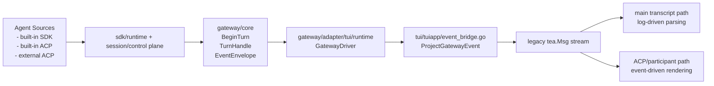
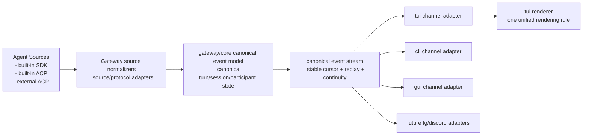

# Gateway Canonical Event Refactor Plan

## Goal

Refactor `gateway` so it becomes the single normalization boundary for agent
output streams across:

- built-in SDK turns
- built-in ACP turns
- external ACP turns

The gateway must emit one canonical, channel-neutral event contract that can be
consumed by `tui`, `cli`, `gui`, and future remote channels such as Telegram or
Discord without each channel rebuilding protocol-specific interpretation logic.

This refactor must also preserve the future ability for external ACP agents to
act as:

- the main controller for a session
- a participant inside a main session
- a subagent delegated from another controller

## Non-Goals

This refactor does **not** make gateway responsible for UI formatting. The
following remain presentation-layer responsibilities:

- `Exploring`
- `Explored 2 files, 1 search`
- `✓ BASH completed`
- drawer/panel/header layout
- channel-specific message chunking and rendering

The gateway owns canonical event semantics, not TUI/GUI/remote rendering.

## Current Architecture

### Current Strengths

- `gateway/core` already owns session lifecycle, turn lifecycle, replay,
  binding, and control-plane state.
- `gateway` already provides a stable turn handle and event cursor contract.
- TUI already enters through `gateway`, not by talking to `sdk/runtime`
  directly.

### Current Problems

1. `gateway.Event` still leaks SDK/session internals:
   - `SessionEvent *sdksession.Event`
   - `Approval *sdkruntime.ApprovalRequest`
2. TUI must interpret gateway events differently for main transcript and
   ACP/participant transcript.
3. `tui/tuiapp/event_bridge.go` is doing protocol-level projection and string
   formatting that should be replaced by canonical gateway event semantics.
4. The main TUI transcript still reconstructs tool lifecycle and exploration
   groupings from log-style lines rather than from structured tool lifecycle
   events.
5. The current contract is not yet suitable for a future world where external
   ACP can be the main controller as well as a participant.

## Target Architecture

### Target Boundary Rules

- `gateway/core` owns canonical event semantics.
- `gateway/core` does **not** own ACP-specific rendering or TUI formatting.
- `gateway/adapter/...` should stay thin and channel-oriented.
- `tui/tuiapp` should render one event model rather than keeping separate
  SDK-vs-ACP projection logic.

## Canonical Event Model

The gateway must define explicit, channel-neutral payloads instead of exposing
raw `sdksession.Event` as the primary contract.

### Event Envelope

Keep:

- `cursor`
- `event`
- `err`

Keep current handle/session metadata:

- `handle_id`
- `run_id`
- `turn_id`
- `session_ref`

### Canonical Payload Families

Each `gateway.Event` should gain canonical payload fields that are safe for
channels to consume without touching raw SDK/session internals:

1. `NarrativePayload`
   - `role`: user / assistant / reasoning / system / notice
   - `text`
   - `final`
   - `is_ui_only`
   - `actor`

2. `ToolCallPayload`
   - `call_id`
   - `tool_name`
   - `args_text`
   - `status`: started / running / completed / failed / waiting_approval /
     waiting_input / interrupted / cancelled / terminated
   - `scope`: main / participant / subagent
   - `actor`
   - `participant_id`

3. `ToolResultPayload`
   - `call_id`
   - `tool_name`
   - `output_text`
   - `error`
   - `status`
   - `scope`
   - `actor`
   - `participant_id`

4. `PlanPayload`
   - `entries`

5. `ApprovalPayload`
   - `tool_name`
   - `command_preview`
   - `options`

6. `ParticipantPayload`
   - `participant_id`
   - `participant_kind`
   - `role`
   - `label`
   - `action`
   - `session_id`
   - `parent_turn_id`

7. `LifecyclePayload`
   - `status`
   - `scope`
   - `actor`
   - `participant_id`

### Compatibility Rule

During migration, `gateway.Event` may temporarily contain both:

- canonical payload fields
- legacy raw fields (`SessionEvent`, `Approval`)

Adapters must move toward canonical fields first. Raw fields become
compatibility-only and will be removed after all adapters no longer depend on
them.

## Scope Model

Canonical events must explicitly represent where an event belongs in the turn
topology:

- `main`
- `participant`
- `subagent`

They must also carry stable actor identity where applicable:

- local controller
- ACP controller
- external ACP participant
- delegated subagent

This is the minimum needed to support future external ACP as either:

- the main controller of the session
- a participant embedded within another controller's session

## Refactor Phases

### Phase 1: Introduce Canonical Payloads Without Breaking Existing Adapters

Objective:

- Add canonical payload structs to `gateway/core/types.go`
- Populate them from `sdksession.Event` and approval requests in
  `gateway/core`
- Update TUI `event_bridge.go` to prefer canonical payloads while keeping
  fallback compatibility with legacy raw fields

Expected result:

- Gateway contract starts owning event normalization
- TUI is no longer forced to parse only raw `SessionEvent` fields for the
  converted paths
- No public behavior regressions

### Phase 2: Unify Tool Lifecycle Semantics In Gateway

Objective:

- Make gateway emit explicit structured tool lifecycle states for all sources
- Normalize SDK / built-in ACP / external ACP tool call progress into the same
  canonical shape
- Stop depending on log-line text to infer `tool call` vs `tool result`

Expected result:

- Channel layers consume one structured tool lifecycle model
- TUI main transcript can stop reconstructing tool lifecycle from strings

### Phase 3: Unify Participant/Subagent/Main Scope Semantics

Objective:

- Normalize main controller, participant, and subagent events into one shared
  scope model
- Ensure external ACP can occupy the same canonical role slots as built-in ACP
- Keep continuity and replay state stable across scope types

Expected result:

- No channel-specific distinction between "ACP event path" and "normal path"
- External ACP main-controller and participant roles are both first-class

### Phase 4: Thin Channel Adapters

Objective:

- Reduce `gateway/adapter/tui/runtime` to channel driver concerns only
- Reduce `tui/tuiapp/event_bridge.go` to a thin canonical-event-to-TUI-event
  mapping
- Introduce equivalent thin bridges for CLI/GUI/future remote channels

Expected result:

- The channel adapters become consumers of gateway semantics, not secondary
  protocol normalizers

### Phase 5: Remove Legacy Raw Event Leakage

Objective:

- Remove or deprecate adapter dependency on:
  - `SessionEvent *sdksession.Event`
  - `Approval *sdkruntime.ApprovalRequest`
- Keep these only where absolutely necessary for compatibility or remove them
  fully once all adapters are migrated

Expected result:

- `gateway.Event` becomes a truly stable product-facing event contract

## Required Code Changes

### Gateway Core

Files:

- `gateway/core/types.go`
- `gateway/core/event_projection.go`
- `gateway/core/handle.go`
- `gateway/core/gateway.go`

Responsibilities:

- define canonical payload types
- project SDK/session/runtime events into canonical payloads
- keep replay/live handles consistent

### Gateway Public API

Files:

- `gateway/api_types.go`

Responsibilities:

- re-export canonical payload types through the stable root package

### TUI Migration Slice

Files:

- `tui/tuiapp/event_bridge.go`
- `tui/tuiapp/*_test.go`

Responsibilities:

- consume canonical gateway payloads first
- keep temporary fallback for legacy raw payloads
- avoid introducing new gateway-specific rendering semantics here

## Testing Strategy

### Gateway Core Tests

- canonical narrative payload is populated for assistant/user/reasoning/system
  session events
- canonical tool call/result payloads are populated from session events
- approval payload is populated from approval requests
- replay events retain canonical payloads
- live handle events and replayed events match semantically

### TUI Adapter Tests

- `event_bridge` can project canonical narrative/tool/approval payloads without
  reading `SessionEvent`
- legacy fallback still works during migration
- existing TUI turn flows continue to pass

### Acceptance Tests

At minimum:

- `go test ./gateway/...`
- `go test ./tui/...`

Follow-up phases should add:

- end-to-end turn coverage for built-in SDK main turns
- built-in ACP main-controller turns
- participant ACP turns
- future external ACP main-controller adoption path

## Acceptance Criteria For This Refactor

The refactor should be considered successful when:

1. Gateway emits canonical payloads for all event categories currently needed
   by TUI.
2. TUI consumes canonical payloads preferentially.
3. New channel adapters can be written without depending on `sdksession.Event`
   details.
4. External ACP can be modeled as either main controller or participant
   without changing the channel-facing event contract.
5. UI-specific formatting remains outside gateway.

## Immediate Execution Plan

1. Add canonical payload types to `gateway/core/types.go`
2. Populate payloads in `event_projection.go` and `handle.go`
3. Re-export them from `gateway/api_types.go`
4. Add focused gateway-core tests for canonical projection
5. Update `tui/tuiapp/event_bridge.go` to prefer canonical payloads
6. Run `go test ./gateway/...` and `go test ./tui/...`
7. Only after this slice is stable, start Phase 2 tool lifecycle unification

## Notes On External ACP As Main Controller

The key architectural rule is:

External ACP must not be modeled as a special channel-only add-on.

Instead, gateway canonical events must treat controller source as metadata, not
as a different rendering protocol. That means:

- a main-controller external ACP turn still emits canonical narrative/tool/plan
  events in `scope=main`
- an external ACP participant emits canonical events in `scope=participant`
- a delegated ACP subagent emits canonical events in `scope=subagent`

This keeps the gateway contract stable while allowing source-specific ingress
logic to evolve independently.
