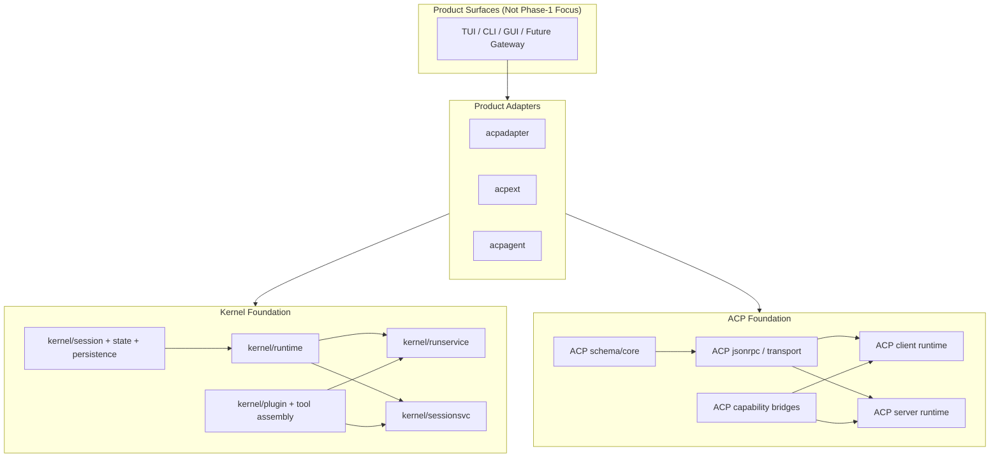

# Kernel + ACP 基础设施骨架 Spec

## 状态

- 文档类型：第一阶段基础设施 spec
- 适用范围：`kernel` 与 `ACP` 基础设施打捞、接口抽象、稳定骨架整理
- 明确非目标：本阶段不追求完整功能迁移，不追求 TUI/CLI/GUI 重写，不追求 Gateway 成熟产品化

## 目的

这份文档用于在长流程重构中固定方向，避免架构目标在大量搬迁、兼容和局部修补中被稀释。

第一阶段只解决一件事：**把 `caelis` 的内建 kernel 与 ACP 相关能力整理成稳定、最小、可依赖的基础设施骨架。**

这意味着当前阶段关注的是：

- 哪些能力属于 `kernel core`
- 哪些能力属于 `ACP infrastructure`
- 两者之间通过什么稳定边界连接
- 哪些现有代码应被打捞保留
- 哪些现有代码只能作为兼容层存在，不能继续主导架构

## 背景判断

当前代码库已经具备真实产品能力，但主要问题不是“功能不够”，而是“边界不够稳定”：

- kernel 已经存在可运行的 session/runtime/tool/delegation 基础
- ACP 已经存在可工作的 server/client/permission/session/update 能力
- 但产品代码、协议代码、执行策略、TUI 投影、CLI 启动装配仍然大量混杂
- 结果是系统可以工作，但难以形成长期稳定的重构主干

因此，第一阶段不做大规模加法，不围绕界面做迁移，而是先把**基础设施骨架**打结实。

## 本阶段范围

本阶段只覆盖以下内容：

1. `kernel` 的最小稳定边界
2. `ACP` 的最小稳定边界
3. `kernel` 与 `ACP` 的连接边界
4. 默认最小装配能力
5. 兼容层的约束方式

本阶段明确不覆盖以下内容：

- TUI 结构重写
- Bubble Tea 视图迁移
- GUI 实现
- 完整 Gateway 产品化
- 所有现有命令入口的统一重写
- 全量插件生态或复杂 provider 体系扩展
- 交互细节、视觉细节、投影细节的最终定稿

## 核心原则

### 1. Kernel 是核心，不是表现层附属物

`kernel` 是系统的内生执行核心，负责：

- session 上下文
- turn 执行
- agent loop
- 工具调用
- delegation/subagent 派生
- 状态持久化与恢复

`kernel` 不依赖 TUI、CLI flag、GUI 状态或 ACP 报文结构。

### 2. ACP 是一等基础设施，不是外围特例

ACP 在系统中必须被视为正式、长期存在的基础设施能力，至少覆盖：

- ACP schema / protocol
- transport / json-rpc connection
- client runtime
- server runtime
- capability bridges
- product adapter

ACP 可以成为：

- 主控来源
- 旁路参与者来源
- subagent 派生来源
- 对外服务出口

但 ACP 不得侵入 `kernel core`。

### 3. Kernel 与 ACP 通过稳定接口相连，而不是彼此穿透

`kernel` 不直接理解 ACP wire protocol。

`ACP` 不直接承载产品 UI 语义。

两者只在受控边界处交汇：

- session runtime boundary
- adapter boundary
- projection / event normalization boundary
- delegation / subagent boundary

### 4. 本阶段先求骨架稳定，不求功能齐全

只要边界、职责和默认装配成立，本阶段允许：

- 保留兼容层
- 保留旧入口
- 保留重复实现的短期存在

但不允许继续让这些兼容层定义未来结构。

### 5. TUI 和 Gateway 在本阶段是消费者，不是设计源头

本阶段不从 TUI 反推 runtime，也不从 CLI 参数反推 kernel。

正确依赖方向是：

`Presentation / Gateway -> Kernel + ACP Infrastructure`

即使 Gateway 将来是产品中枢，本阶段也不先做 Gateway 全面重构，而是先把它未来要依赖的基础能力固定下来。

## 目标拓扑

## 阶段目标

本阶段完成后，系统至少应具备以下骨架特征：

1. `kernel` 能作为独立基础层被装配和调用，而不需要 TUI/CLI 参与
2. ACP server/client 能作为独立基础层被装配和调用，而不需要 `cmd/cli` 参与
3. `acpadapter`、`acpext`、`acpagent` 作为产品适配层依赖上述基础层
4. 未来 Gateway 可以只依赖稳定接口，而不是直接知道 runtime/store/tool/policy/acp wire 细节
5. 默认最小装配成立：coding 基础工具组 + 基于标准 ACP 的 subagent 派生

## Kernel Foundation 规范

### 目标职责

`kernel` 负责系统的本地核心执行语义：

- session 模型
- 事件与状态存储
- turn 运行
- tool 执行与默认 core tools
- policy 执行
- task 与 delegation
- subagent runner 接口

### 稳定边界

第一阶段将以下包视为稳定骨架的优先保留对象：

- `kernel/runtime`
- `kernel/session`
- `kernel/runservice`
- `kernel/sessionsvc`
- `kernel/tool`
- `kernel/plugin`
- `kernel/policy`
- `kernel/task`

### 关键要求

#### A. `kernel/runtime` 是最小执行核心

它负责 run loop、invocation context、tool map、state snapshot、delegation/subagent runner 接口。

它不负责：

- ACP session 协议语义
- UI 投影
- CLI 参数解析
- 展现层路由

#### B. `kernel/runservice` 是 turn 级装配边界

它负责：

- 按 session 组装执行能力
- 注入默认最小工具集
- 注入默认 spawn 能力
- 将 `runtime.RunRequest` 收敛为更稳定的产品级 turn 执行入口

它应继续保持为 `runtime` 之上的窄包装，而不是反向吞并产品逻辑。

#### C. `kernel/sessionsvc` 是 session 级边界

它负责：

- start/load/run/interrupt/list 这类 session 生命周期能力
- session ref 与 workspace ref 组织
- active turn 生命周期管理

未来 Gateway 应优先依赖 `sessionsvc` 级能力，而不是直接落到 `runtime`。

#### D. `kernel/plugin` 是最小插件装配基础

本阶段不扩展为庞大插件系统，只要求它足以承载：

- tool provider
- policy provider
- provider 生命周期钩子
- provider schema 元数据

这套机制是未来“kernel 支持插件化装配”的最小起点。

### 默认最小装配

本阶段必须明确存在一套默认最小装配，而不是要求所有能力都由产品层硬编码：

- 默认 core coding tools
- 默认 policy hooks
- 默认 self-spawn / ACP subagent 派生能力

默认最小装配是骨架的一部分，不是临时脚手架。

## ACP Foundation 规范

### 目标职责

ACP 基础设施负责协议世界，而不是产品表现层。

必须覆盖：

- schema/core
- json-rpc / transport
- client runtime
- server runtime
- capability bridges

### 分层目标

第一阶段采用以下目标分层：

#### Layer 1: ACP Schema / Core

职责：

- protocol message structs
- method/update constants
- typed request/response/update model
- raw content/tool-call model

要求：

- 消除 client/server 重复 schema 定义
- schema 层不依赖本地进程管理或产品代码

#### Layer 2: JSON-RPC / Transport Core

职责：

- request/response correlation
- notification dispatch
- stdio framing
- connection 生命周期

要求：

- client 与 server 复用同一套 transport/core 能力
- transport 层不掺入 session 语义

#### Layer 3: ACP Client Runtime

职责：

- initialize
- new/load session
- prompt / promptParts
- cancel
- mode/config
- update decoding

要求：

- 将“协议客户端”与“本地进程拉起”分离
- 允许未来同时支持 stdio、本地 loopback 或其他 transport

#### Layer 4: ACP Server Runtime

职责：

- request handling
- session registry
- update emission
- capability negotiation
- adapter contract

要求：

- server runtime 只依赖抽象 adapter
- 不把 `caelis` 的产品语义硬编码进 server 核心

#### Layer 5: ACP Capability Bridges

职责：

- fs
- terminal
- permission

要求：

- capability bridge 与具体执行策略分离
- bridge 负责协议映射，不负责产品决策

## Kernel 与 ACP 的连接方式

本阶段只允许通过以下两类连接方式把 ACP 接到 kernel 体系中。

### 1. ACP Server -> Kernel Session Runtime

对外 `caelis acp` 暴露时：

- ACP server runtime 通过 adapter 访问 `kernel/sessionsvc`
- adapter 负责协议请求与 session runtime 能力之间的映射
- session mode/config/prompt image 等协议扩展均在 adapter 层解释

这条路径的主要打捞对象是：

- `internal/app/acpadapter`

### 2. ACP External Controller / Subagent -> Kernel Delegation / Session Stream

外部 ACP 作为主控或 subagent 时：

- ACP client runtime 负责远端 session 生命周期
- product adapter 负责 handoff、meta、session reuse、projection normalization
- 归一化后的事件流写入 kernel/sessionstream 或 canonical session events

这条路径的主要打捞对象是：

- `pkg/acpagent`
- `internal/app/acpext/self_runner`
- `internal/app/acpext/session_update_bridge`

## 明确保留的打捞对象

以下现有实现被认定为第一阶段优先打捞对象：

- `kernel/runtime`
- `kernel/runservice`
- `kernel/sessionsvc`
- `kernel/plugin`
- `pkg/acpagent`
- `pkg/acpmeta`
- `internal/acp`
- `internal/acpclient`
- `internal/acpconn`
- `internal/app/acpadapter`
- `internal/app/acpext`

这些对象的价值不在于保持文件原样，而在于保留其已经验证过的责任划分和运行语义。

## 明确不作为骨架来源的对象

以下对象在本阶段只能作为兼容消费者存在，不应继续主导基础架构：

- `cmd/cli` 里的运行时装配逻辑
- 任何 TUI 驱动的 runtime 设计
- 任何把 ACP server/client 直接放进表现层入口的做法
- 任何把 runtime/store/tool/policy/acp callback 全部暴露给未来 Gateway 的做法

## 兼容层策略

本阶段允许保留兼容层，但兼容层必须满足以下约束：

1. 兼容层只转发，不重新定义核心语义
2. 兼容层不新增基础设施职责
3. 兼容层不成为新调用方的首选依赖
4. 兼容层存在的唯一目的，是给后续 Gateway / CLI / TUI 迁移留缓冲

因此，像 `internal/app/runservice`、`internal/app/sessionsvc` 这类 wrapper 可以暂时保留，但只能是过渡件。

## Gateway 在本阶段的定位

本阶段不要求完成 Gateway 产品化，但要求为 Gateway 的未来形态预留稳定下层接口。

Gateway 的未来职责已经明确：

- session lifecycle orchestration
- controller binding / handoff
- participant attachment
- route / resume / attach / reconnect

但在第一阶段，Gateway 不必完整实现这些产品能力。

它只需要满足一条约束：**未来 Gateway 不应直接依赖 TUI 细节，也不应直接理解 ACP wire 细节。**

## 骨架完成判据

第一阶段完成时，应满足以下判据：

1. 可以在不引入 TUI 的情况下装配并运行 kernel session turn
2. 可以在不引入 `cmd/cli` 的情况下装配 ACP server/client
3. `acpadapter` 能作为明确的 server-side product adapter 独立存在
4. `acpext` / `acpagent` 能作为明确的 client-side product adapter 独立存在
5. 默认 coding tools 与 ACP subagent 派生能力有稳定装配入口
6. 新的 Gateway 设计可以只依赖稳定接口，而不是复制旧 CLI 装配逻辑

## 与现有文档的关系

本文件是第一阶段“基础设施骨架”约束文档。

相关但职责不同的文档：

- `docs/mvp_architecture.md`
  负责描述整体方向与高层边界
- `docs/acp_infra_gap_analysis.md`
  负责分析现状问题与 ACP 基础设施拆分方向
- `docs/acp_interaction_architecture.md`
  负责描述主控 ACP、旁路 ACP、handoff 与单轨会话等交互语义

本文件的职责是把这些已有判断收敛为**第一阶段必须稳定下来的基础设施骨架规范**。

## 结论

第一阶段的成功标准不是“新 TUI 已经跑起来”，也不是“所有入口都已经迁移完”。

第一阶段的成功标准是：

- `kernel` 已经被整理为稳定核心
- `ACP` 已经被整理为稳定基础设施
- 两者之间的连接方式已经被收敛为清晰、最小、可维护的边界

只有在这个基础上，后续 Gateway、TUI、CLI 和对外 ACP server 的统一才不会再次退化为表现层驱动的重组。
