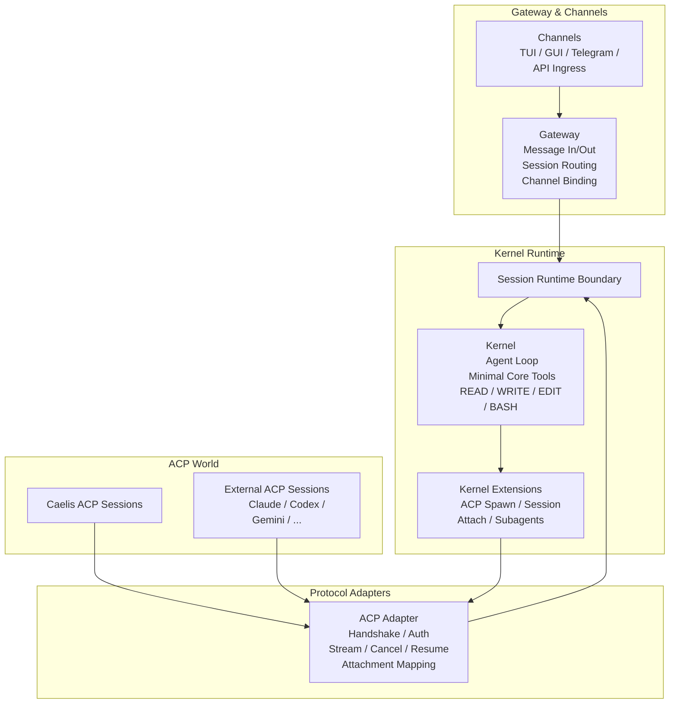

# MVP Architecture

## 关键边界

- `Channels` 是入口和出口，不等于 `Session`。
- `Gateway` 只负责消息接入、消息分发、channel 到 session 的绑定，不参与 agent loop。
- `ACP` 不是普通 `Channel`，而是独立的 `Protocol Adapter / Boundary Adapter`。
- `Session Runtime Boundary` 是 `Gateway` 和 `Kernel` 之间的稳定接口。
- `Kernel` 是纯正的 agent loop，只保留最小原生能力和基础工具。
- `Kernel Extensions` 承载 `ACP` 相关能力，如 `SPAWN`、session attach、subagent 管理。
- `ACP Adapter` 负责 handshake、auth、capability negotiation、stream/cancel/resume、attachment 映射。
- `ACP` 是一等公民，但通过扩展层和协议适配层进入系统，不侵入 `Kernel Core`。
- `self` 派生和未来外部 agent 都统一落在 `ACP World` 中。

## 对象关系

- `Channel` 负责访问和展示。
- `ACP Adapter` 负责协议映射，而不是入口展示。
- `Session` 负责执行和上下文。
- `Kernel` 驱动当前 session。
- `Kernel Extensions` 可以为当前 session 派生新的 ACP session。
- `Gateway` 可以决定新消息进入已有 session，或创建新的 session。

## MVP 范围

- 初版只要求打通 `self` 的 ACP 派生。
- 外部 agent 保留在架构中，但不作为初版实现目标。
- TUI/GUI 作为 `Channel` 存在，围绕 session 管理和展示构建。
- ACP server/client 作为协议适配层存在，复用同一套 `Session Runtime Boundary`。
