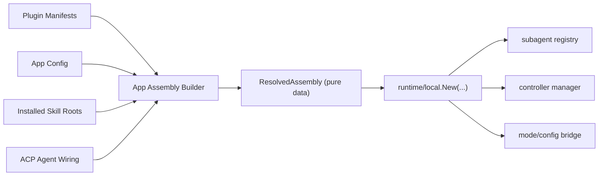

# Plugin / Agent Assembly Boundary Plan

## Goal

Define one minimal, stable boundary for:

- app-owned ACP agent declarations
- app-owned skill bundle wiring
- runtime consumption of one resolved assembly

The design goal is not to build a large plugin runtime inside `sdk`.
The goal is to make `sdk` consume **pure resolved data**, while:

- `app` discovers plugins
- `app` parses manifests
- `app` resolves precedence and config
- `runtime` builds behavior objects from that data

This follows the same broad shape used by Codex:

- manifest / manager / install logic live in app/service layers
- runtime consumes resolved outputs
- skills are filesystem bundles with precedence and namespace rules

## Scope

### In scope

1. ACP agent declarations
2. skill bundle declarations
3. app-owned mode/config hook points later

### Out of scope

1. external `tool.Tool` injection
2. dynamic Go plugin loading
3. marketplace install/update logic inside `sdk`
4. in-process third-party code plugins

## Core Rules

1. `sdk/plugin` is a **data contract package**, not a plugin host.
2. `ResolvedAssembly` is **pure data**, not a bag of runtime interfaces.
3. Runtime objects like registries and managers are built **from** assembly data.
4. ACP agent declarations are app-owned.
5. Skills are filesystem bundles, not in-memory plugin code.
6. External tools are not plugin contributions in this phase.
7. Subagent and controller paths must share the same ACP agent source.

## Why This Shape

### Go / Rust constraint

For Go and Rust, the stable extension model is:

- manifest-driven discovery
- external process / protocol-backed integration
- app-owned resolution
- runtime-owned behavior construction

This avoids:

- ABI fragility
- runtime dynamic linking complexity
- coupling protocol churn to kernel internals

### Codex lessons to copy

From local `codex`:

1. Plugin manifests are lightweight declarations.
   - `codex-rs/core/src/plugins/manifest.rs`
2. Plugin management is app/service owned.
   - `codex-rs/core/src/plugins/manager.rs`
3. Skills are loaded from multiple roots with precedence and dedupe.
   - `codex-rs/core-skills/src/loader.rs`
4. Skill namespace comes from nearest plugin manifest, not from runtime wiring.
   - `codex-rs/utils/plugins/src/plugin_namespace.rs`

The important pattern is:

- manager builds resolved output
- runtime consumes resolved output

not:

- runtime owns plugin lifecycle

## Architecture



The key split is:

- **app builds data**
- **runtime builds behavior**

## Boundary Summary

### `sdk/plugin`

Owns:

- pure data types needed by `sdk`

Does not own:

- discovery
- manifest parsing
- install/update
- plugin manager lifecycle
- host/cache implementations

### `sdk`

Owns:

- runtime behavior
- subagent/controller/policy integration
- building behavior objects from assembly data

Does not own:

- plugin discovery
- plugin metadata UI
- marketplace logic
- skill installation

### `acp`

Owns:

- ACP schema
- jsonrpc / transport / client / server core

Does not own:

- plugin semantics
- Caelis runtime integration

### `acpbridge`

Owns:

- runtime/session/terminal/permission bridge to ACP

Does not own:

- plugin discovery
- plugin manager lifecycle

### `app`

Owns:

- plugin manifest parsing
- plugin metadata
- precedence resolution
- skill enable/disable config
- ACP command / endpoint wiring
- building `ResolvedAssembly`

## Pure Data Contracts

The central correction is:

**`ResolvedAssembly` must be pure data.**

It must not contain:

- `subagent.Registry`
- `controller.ACP`
- policy interfaces
- runtime behavior objects

That would mix:

- what is declared
- how runtime uses it

### Reuse existing `AgentConfig`

Do not introduce a parallel `ACPAgentDecl`.

Current shape in `sdk/subagent/acp/registry.go` is already the right base:

- `Name`
- `Description`
- `Command`
- `Args`
- `Env`
- `WorkDir`

If later needed, extend this shape for endpoint / transport.

Recommended direction:

- move or alias this type into `sdk/plugin`
- consume the same shape everywhere

This avoids:

- duplicate types
- conversion layers
- drift between subagent and controller paths

### Proposed `sdk/plugin` surface

#### `AgentConfig`

Pure ACP agent declaration data:

- `name`
- `description`
- `command`
- `args`
- `env`
- `work_dir`
- future:
  - `endpoint`
  - `transport`

#### `SkillBundle`

Pure skill contribution data:

- `plugin`
- `namespace`
- `root`
- `disabled`

Important:

- do not model this as `enabled bool`
- default should be **all discovered skills enabled**
- app only supplies explicit disables

This matches Codex better and keeps config maintenance low.

#### `ResolvedAssembly`

Phase-target shape:

```text
ResolvedAssembly {
  Agents []AgentConfig
  Skills []SkillBundle
  Modes  []ModeConfig      // reserved
  Configs []ConfigOption   // reserved
}
```

This object should be:

- serializable
- cacheable
- testable
- reusable across runtimes

## Skill Bundle Semantics

### Why `disabled`, not `enabled`

Codex resolves skills by:

- discovering all skill roots
- applying precedence
- filtering disabled paths

That is better than forcing app config to enumerate every enabled skill.

Recommended semantics:

- all discovered skills under a bundle are enabled by default
- app may disable a subset by name/path

This keeps rollout simple when a plugin adds a new skill.

### Namespace strategy

This must be explicit.

Multiple plugins may contribute skills with the same local name.

Recommended rule:

- each `SkillBundle` has a `namespace`
- default namespace = plugin name
- fully qualified skill identity = `namespace:name`

Within one namespace:

- skill names must be unique

Across namespaces:

- duplicate local names are allowed

This mirrors the Codex plugin namespace idea and avoids cross-plugin collisions.

## Runtime Construction

### Current problem

Today `runtime/local.Config` still accepts multiple independent behavior objects:

- `Controllers`
- `Subagents`
- `SubagentRegistry`

That leaves an implicit invariant:

- all three must describe the same ACP agent world

### Target shape

Add one new field:

```go
type Config struct {
    Sessions     sdksession.Service
    AgentFactory sdkruntime.AgentFactory
    Assembly     plugin.ResolvedAssembly
    // existing fields remain for compatibility during migration
}
```

Then `runtime/local.New()` should:

1. build ACP subagent registry from `Assembly.Agents`
2. build ACP subagent runner from that registry
3. build ACP controller manager from the same registry
4. keep explicit overrides supported for backward compatibility

This eliminates hidden mismatches between:

- subagent registry
- controller manager
- runtime wiring

## Assembly Builders

### Important rule

The adapter should be **functions**, not a stateful host type.

Recommended shape:

```text
NewSubagentRegistry(agents []AgentConfig) -> Registry
NewControllerManager(registry, ...) -> Manager
BuildRuntimeConfig(assembly ResolvedAssembly, ...) -> local.Config
```

This keeps the assembly step:

- pure
- deterministic
- easy to test

Do not add a `sdk/plugin/memory` host.
That would reintroduce a fake lifecycle inside `sdk`.

If a helper is needed, keep it as:

- `sdk/plugin/builder`
or
- app-layer assembly code

but not as a runtime plugin host abstraction.

## Conflict Resolution and Validation

This must happen at assembly time, not runtime.

### Agent conflicts

If multiple sources declare the same agent name:

- either fail fast
- or apply one explicit precedence order

Recommended precedence:

1. app config override
2. plugin-contributed agents
3. built-in default agents

And validate:

- name is non-empty
- command or endpoint exists
- no duplicate effective names after precedence resolution

### Skill conflicts

Within the same namespace:

- duplicate skill names should fail

Across namespaces:

- duplicates are fine

## Manifest Boundary

Plugin metadata like:

- name
- version
- description
- UI metadata

belongs to app/service layers, not `sdk/plugin`.

That means `sdk/plugin` should **not** contain:

- `Descriptor`
- marketplace metadata
- installation state

Those are useful to:

- app UI
- plugin manager
- marketplace sync

but not to the runtime itself.

## How This Fits Existing Code

### Today

Manual wiring exists in:

- `sdk/subagent/acp/registry.go`
- `sdk/controller/acp/manager.go`
- `sdk/runtime/local/runtime.go`
- `acpbridge/cmd/e2eagent/main.go`
- `sdk/runtime/local/e2e_test.go`

### Target

Those call sites should stop constructing agent registries independently.

Instead:

1. app resolves `ResolvedAssembly`
2. runtime builds behavior from `ResolvedAssembly.Agents`
3. `SPAWN`, sidecar attach, and handoff all use the same source

## Recommended Phase Plan

### Phase 1a: Minimal Agent Assembly MVP

Implement only:

- `sdk/plugin.AgentConfig`
- `sdk/plugin.ResolvedAssembly`
- `runtime/local.Config.Assembly`

No skills yet.

Acceptance:

- runtime accepts one assembly object
- runtime can build ACP subagent/controller wiring from `Assembly.Agents`

### Phase 1b: Shared Builders

Extract shared functions:

- build ACP subagent registry from agents
- build ACP controller manager from that registry

Use them in:

- `runtime/local`
- `acpbridge/cmd/e2eagent`
- e2e helpers

Acceptance:

- no more duplicated ACP agent wiring in tests/examples

### Phase 2: Skill Bundle Assembly

Add:

- `sdk/plugin.SkillBundle`
- disabled-skill semantics
- namespace rules

Keep discovery/config parsing in app.

Acceptance:

- assembly can carry resolved skill bundles
- app can disable subsets
- future runtime/bridge consumers can use the same roots

### Phase 3: Mode / Config Hook-in

Add:

- `Modes`
- `Configs`
to `ResolvedAssembly`

Use them through `acpbridge/agentruntime`.

Acceptance:

- `new/load/set_mode/set_config_option` use app-owned assembly data

## Stable Rules

These should remain fixed:

1. `sdk/plugin` is pure data only.
2. `ResolvedAssembly` is pure data only.
3. Assembly building is app-owned.
4. Runtime builds behavior objects from assembly data.
5. `AgentConfig` is shared across subagent/controller assembly.
6. Skills use namespace + disabled-list semantics.
7. External tools are not plugin contributions in this phase.

## Recommended Next Step

Implement only Phase 1a + 1b first.

That means:

1. add `sdk/plugin.AgentConfig`
2. add `sdk/plugin.ResolvedAssembly`
3. add `runtime/local.Config.Assembly`
4. add shared ACP registry/controller builder functions
5. switch:
   - `runtime/local`
   - `acpbridge/cmd/e2eagent`
   - runtime e2e helpers
   to use assembly-driven wiring

This is the narrowest useful step and matches the current codebase best.
