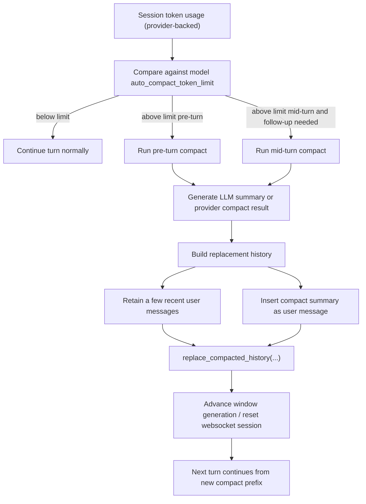
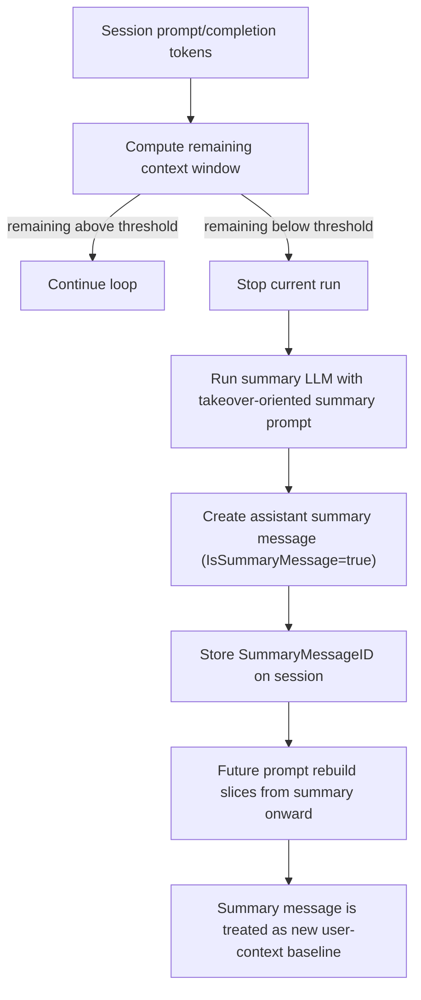
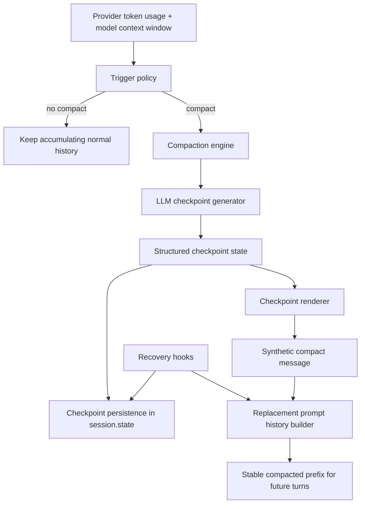

# SDK Compaction Chain Audit And Design

## Status

This document supersedes the earlier
`/Users/xueyongzhi/WorkDir/xueyongzhi/caelis/docs/sdk_compaction_recovery_design.md`
design where it conflicts with the direction below.

The earlier SDK compaction implementation proved directionally wrong in four
important ways:

1. it relied on heuristic token estimates instead of provider-reported token
   usage as the primary trigger source
2. it used a fixed soft token limit instead of model-window-relative
   watermarks
3. it allowed heuristic fallback summaries instead of enforcing an LLM-only
   checkpoint compaction path
4. it rebuilt dynamic prompt blocks every turn, which is unfriendly to KV cache
   reuse and diverges from the stronger Codex / Crush / old-kernel patterns

This document re-audits:

- the old Caelis kernel compact path
- Crush compact path
- Codex compact path

It then defines the corrected compact architecture for the current SDK.

The goals here are:

- preserve the core direction of Codex / Crush / old kernel
- adapt it cleanly to the current SDK layering
- keep the compact engine runtime-pluggable
- stabilize interfaces before further implementation

## Audit Scope

### Old Caelis Kernel

Primary references:

- `/Users/xueyongzhi/WorkDir/xueyongzhi/caelis/kernel/runtime/compaction.go`
- `/Users/xueyongzhi/WorkDir/xueyongzhi/caelis/kernel/compaction/compaction.go`
- `/Users/xueyongzhi/WorkDir/xueyongzhi/caelis/kernel/compaction/checkpoint.go`

### Crush

Primary references:

- `/Users/xueyongzhi/WorkDir/github/crush/internal/agent/agent.go`
- `/Users/xueyongzhi/WorkDir/github/crush/internal/agent/templates/summary.md`
- `/Users/xueyongzhi/WorkDir/github/crush/internal/session/session.go`

### Codex

Primary references:

- `/Users/xueyongzhi/WorkDir/github/codex/codex-rs/core/src/codex.rs`
- `/Users/xueyongzhi/WorkDir/github/codex/codex-rs/core/src/compact.rs`
- `/Users/xueyongzhi/WorkDir/github/codex/codex-rs/core/src/compact_remote.rs`
- `/Users/xueyongzhi/WorkDir/github/codex/codex-rs/core/templates/compact/prompt.md`
- `/Users/xueyongzhi/WorkDir/github/codex/codex-rs/core/templates/compact/summary_prefix.md`
- `/Users/xueyongzhi/WorkDir/github/codex/codex-rs/core/src/context_manager/history.rs`

## What Codex Actually Does

### Trigger Source

Codex primarily uses provider-backed token accounting, not heuristic prompt
estimation, to decide whether auto-compaction is needed.

Relevant points:

- `Session::get_total_token_usage()` reads accumulated `TokenUsageInfo`
- `update_token_usage_info(...)` updates token usage from real response usage
- `run_pre_sampling_compact(...)` compares total usage against
  `auto_compact_token_limit`
- `run_turn(...)` also checks total usage after sampling and can trigger
  mid-turn compact when the model needs follow-up and the context limit has been
  reached

Only secondary diagnostics use heuristic estimation.

### Trigger Timing

Codex has three meaningful compact timings:

1. pre-turn compact
2. mid-turn compact because the model still needs follow-up and the context
   limit has been reached
3. manual compact

It also has a special pre-turn compact path when downshifting to a smaller
context-window model.

### Trigger Watermark

Codex does not use a relative watermark like old Caelis. It compares total token
usage against a model-specific `auto_compact_token_limit`.

This still shares the same core idea:

- trigger based on actual model-context usage
- compact only when close enough to the real model limit
- compact before or during turn execution, not every few steps

### Compact Prompt

Inline compact uses:

- `templates/compact/prompt.md`
- a running summary prefix from `templates/compact/summary_prefix.md`

The prompt asks for a handoff summary for another LLM and explicitly frames the
operation as context checkpoint compaction.

### Compact Output Form

Codex does not keep compaction as a normal transcript append. It creates a new
replacement history and atomically replaces the model-visible history.

The replacement history is built from:

- some retained recent user messages
- one synthesized user-role summary message containing the compaction summary

It also persists a `CompactedItem` rollout artifact so the operation is
reconstructible at the thread/rollout layer.

### Continuity Guarantee

Codex preserves continuity by:

- replacing long history with a single checkpoint summary
- preserving a small amount of recent user message context
- preserving special rollout artifacts
- reinjecting canonical initial context at a model-expected boundary

This is KV-cache-friendly relative to replaying full history because:

- system / initial context stay structurally stable
- pre-compact history is replaced only when compaction occurs
- after compaction, the new prefix stays stable until the next compact

### Overflow Handling

Codex does not fall back to heuristic truncation when compact itself overflows.
Instead:

- inline compaction removes oldest history items and retries
- other transport failures use retry / reconnect logic

This is a strong signal for the SDK design:

- no heuristic summary fallback
- segmented or oldest-first retry is acceptable
- compaction remains an LLM-backed checkpoint operation

## Codex Compact Flow



## What Crush Actually Does

### Trigger Source

Crush uses real session token accounting:

- session prompt tokens
- session completion tokens
- current model context window

It does not primarily depend on heuristic estimation.

### Trigger Timing

Crush checks for auto-summarization inside the agent step loop using
`StopWhen(...)`. This is not "every N steps"; it is:

- continue normal loop
- once remaining context drops below a threshold, stop the current run and
  summarize

### Trigger Watermark

Crush uses two forms:

- for large models above 200k context: fixed 20k remaining-token buffer
- otherwise: 20% remaining-token threshold

That means:

- context-window-relative trigger for smaller windows
- fixed absolute remaining buffer for very large windows

### Compact Prompt

Crush uses a long takeover-oriented summary prompt in
`templates/summary.md`.

It strongly emphasizes:

- exact current state
- files changed
- files read
- commands that worked or failed
- architecture decisions
- exact next steps

This is not a minimal compression prompt. It is optimized for continuity and
teammate handoff.

### Compact Output Form

Crush writes a real assistant summary message with `IsSummaryMessage=true`.

Then it stores `SummaryMessageID` on the session.

Later, when prompt history is rebuilt:

- the message list is sliced from `SummaryMessageID`
- that summary message is re-labeled as `user`
- all earlier messages are effectively dropped from future model context

So Crush does not replace thread history at the storage layer. It replaces the
effective prompt baseline by anchoring future prompt construction to the summary
message.

### Continuity Guarantee

Crush preserves continuity by:

- making the summary exhaustive
- treating it as the only surviving context
- including TODO state explicitly
- telling the future assistant how to continue

This is simpler than Codex, but much less structured.

It is continuity-strong, but merge/update-weak.

## Crush Compact Flow



## What The Old Caelis Kernel Actually Does

### Trigger Source

Old Caelis uses model-context-window-aware budgeting:

- resolve model context window
- reserve output budget
- reserve safety margin
- compute effective input budget
- compact when current token watermark crosses the configured ratio

The defaults are strong:

- `WatermarkRatio = 0.7`
- `MinWatermarkRatio = 0.5`
- `MaxWatermarkRatio = 0.9`
- `ReserveOutputTokens = 4096`
- `SafetyMarginTokens = 1024`

### Trigger Timing

The old kernel compact path is fundamentally pre-turn / pre-run.

It can also be forced during overflow recovery.

### Compact Output Form

Old Caelis persisted compaction as a compaction event with checkpoint metadata.

That was useful for inspection, but it blurred two layers:

- durable transcript
- durable checkpoint

For the SDK, that mixing should not be kept.

### Continuity Guarantee

The old kernel's strongest idea is not the event shape. It is:

- structured checkpoint schema
- mergeable checkpoint updates
- runtime-state-aware checkpoint enrichment
- tail preservation
- overflow recovery

That structured checkpoint design is the most valuable part to keep.

## Synthesis: What We Should Keep

### From Codex

- compaction as a first-class runtime operation
- actual token-usage-driven triggering
- replacement-history mental model
- retry / overflow recovery instead of heuristic fallback
- stable-prefix behavior between compactions

### From Crush

- handoff-quality checkpoint prompt
- emphasis on exact next steps, changed files, commands, risks
- continuity-first summary framing

### From Old Caelis

- structured checkpoint schema
- merge/update semantics across multiple compactions
- explicit context-window budgeting
- recovery hooks tied to runtime state

## Corrected SDK Compact Direction

The current SDK compact direction should change to:

1. provider-token-first budget accounting
2. context-window-relative trigger policy
3. LLM-only checkpoint generation
4. replacement-history style compacted prompt baseline
5. stable prefix until next compact
6. no heuristic summary fallback
7. segmented compaction retry on compaction-input overflow

## Corrected SDK Architecture



## Corrected SDK Prompt Model

The prompt model should be:

1. immutable system prompt
2. accumulated post-compact raw history
3. current user input

When compaction occurs:

- everything after the system prompt and before the most recent preserved tail
  is compacted into one checkpoint
- future turns start from:
  - system prompt
  - one compact checkpoint message
  - post-compact raw history

There should not be a per-turn dynamic runtime-state block that changes the
prefix every turn.

That dynamic-prefix approach is what made the previous SDK design KV-unfriendly.

## Corrected SDK Message Injection Model

The SDK should separate two layers:

### Durable State

Persist the checkpoint as structured state in `session.state`.

Do not persist checkpoint as a canonical transcript event.

### Model-visible Replacement History

At prompt-build time, render one synthetic compact message from the checkpoint.

This synthetic message should be treated like a model-visible checkpoint anchor,
similar to:

- Codex summary-as-user-message
- Crush summary-as-new-baseline

For the SDK, that means:

- checkpoint stays structured in durable state
- prompt sees one synthetic compact message

This preserves:

- old Caelis structure
- Codex / Crush continuation semantics
- cleaner session durability

## Trigger Policy For The SDK

### Primary Source

Always prefer:

- provider-reported token usage
- model-reported or configured context window

Only fall back to heuristic estimation when provider usage is not available.

### Default Watermarks

The default policy should be ratio-based against effective prompt budget:

- effective input budget = context window - reserve output - safety margin
- start considering compact at 70%
- recommend compact around 80% to 85%
- force compact by 90% to 95%

This keeps the old-kernel idea while matching the user's requirement for large
context windows like 200k.

### Trigger Timing

Default compact timing:

1. pre-turn auto compact
2. mid-turn compact only for real overflow / context-limit continuation cases
3. manual compact

No "every few steps" policy.

## LLM-only Checkpoint Generation

The compact engine should always use an LLM-generated checkpoint.

There should be no normal-path fallback to:

- heuristic summary
- truncation summary
- ad hoc prompt clipping

If compaction generation fails because the compaction input itself is too large,
the engine should switch to segmented compaction.

## Segmented Compaction Strategy

### Why It Is Needed

When there is too much unsummarized history since the last checkpoint, even the
compaction prompt can exceed the compact model's input budget.

In that case, do not truncate.

### Recommended Algorithm

Use fold-style segmented compaction:

1. start with the previous checkpoint
2. split unsummarized history into ordered segments
3. run the LLM compact prompt on segment 1 with base checkpoint
4. produce checkpoint revision 1
5. use checkpoint revision 1 as the base for segment 2
6. continue until all segments are folded into one final checkpoint

If a segment still overflows:

- split it recursively
- oldest-first or binary split is acceptable

This preserves the "LLM-only checkpoint" rule without heuristic fallback.

## Recovery Semantics

Recovery stays runtime-owned, not checkpoint-owned.

Recovery responsibilities:

- repair orphaned tasks
- repair orphaned subagent anchors
- validate checkpoint cursor against session history
- discard impossible pending continuations

Recovery should not:

- synthesize compact summaries heuristically
- add approval state to session durability

## How To Preserve Work Direction Across Multiple Compactions

This is the most important continuity property.

The SDK should use:

1. a structured checkpoint schema
2. previous checkpoint as an explicit input to the next compaction
3. the new unsummarized event range as the incremental update source
4. a merge-aware compaction prompt

That means each compaction is not "summarize the whole world again".
It is:

- "update this checkpoint using the new history since checkpoint cursor"

This is how the SDK avoids losing:

- task objective
- durable decisions
- verified facts
- active plan direction
- blockers
- next actions

over many successive compactions.

## Stable Interface Contracts

The compact engine should be independently replaceable.

The runtime should depend on interfaces like these, not on one hard-coded
implementation:

```go
type UsageSnapshot struct {
    TotalTokens        int
    EstimatedTokens    int
    ContextWindow      int
    EffectiveInputBudget int
    Source             UsageSource
}
```

```go
type BudgetProvider interface {
    Snapshot(context.Context, runtime.CompactionRequest) (UsageSnapshot, error)
}
```

```go
type TriggerDecision struct {
    ShouldCompact bool
    Reason        string
    Phase         string
    Segment       bool
}
```

```go
type TriggerPolicy interface {
    Decide(context.Context, UsageSnapshot, runtime.CompactionRequest) (TriggerDecision, error)
}
```

```go
type CheckpointGenerator interface {
    Generate(context.Context, CheckpointInput) (checkpoint.State, error)
}
```

```go
type SegmentCompactor interface {
    CompactSegmented(context.Context, SegmentedCheckpointInput) (checkpoint.State, error)
}
```

```go
type PromptBaselineBuilder interface {
    Build(context.Context, PromptBaselineInput) (PromptBaseline, error)
}
```

```go
type RecoveryHook interface {
    Recover(context.Context, runtime.RecoveryRequest) error
}
```

```go
type Engine interface {
    MaybeCompactPreTurn(context.Context, runtime.CompactionRequest) (Result, error)
    CompactOnOverflow(context.Context, runtime.CompactionRequest, error) (Result, error)
}
```

### Why This Interface Split Is Better

- `runtime` owns orchestration, not compaction details
- budget source can swap between provider-backed and heuristic-backed
- trigger policy can evolve without changing checkpoint generation
- checkpoint generation can swap between local LLM, remote LLM, or provider
  compact APIs
- recovery remains isolated from compaction text generation

## Recommended SDK Implementation Shape

Recommended packages:

```text
sdk/checkpoint
sdk/compact
sdk/compact/engines/checkpointllm
sdk/compact/budget
sdk/compact/policy
sdk/compact/recovery
```

With responsibility:

- `sdk/checkpoint`
  - structured checkpoint state and rendering
- `sdk/compact`
  - stable engine interfaces
- `sdk/compact/budget`
  - provider-token-first usage snapshot provider
- `sdk/compact/policy`
  - ratio / watermark trigger logic
- `sdk/compact/engines/checkpointllm`
  - LLM-only checkpoint compaction engine with segmented retry
- `sdk/compact/recovery`
  - runtime repair hooks

## Recommended First Implementation Order

1. replace current fixed-threshold compact trigger with provider-token-first
   budget snapshots
2. replace dynamic checkpoint-block injection with replacement-baseline prompt
   construction
3. remove heuristic summary fallback from the normal path
4. add segmented LLM compaction retry for overflow
5. add true long-running compact e2e with multiple compactions
6. add real token-budget / compression-ratio assertions

## E2E Requirements Before Declaring This Done

The new compact engine is not complete until all of these pass:

1. real provider pre-turn compact continuity e2e
2. real provider multi-compaction long-task e2e
3. real provider compact-overflow segmented retry e2e
4. token-budget e2e that asserts compacted prompt stays within configured
   budget
5. compression-ratio e2e that reports pre/post token counts
6. KV-stability regression test that proves prompt prefix remains stable between
   compactions

## Final Direction

The SDK should not copy Codex or Crush literally.

It should preserve:

- Codex's first-class replacement-history compact model
- Crush's handoff-quality prompt
- old Caelis' structured checkpoint and merge semantics

That combination is the cleanest fit for the current SDK.
